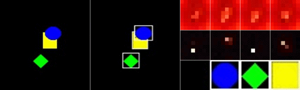

# Project Page for AAAI 2019 Submission 
# Paper ID: 792


<!--
Paper Title: **Tracking by Animation: Unsupervised Learning of Multi-Object Attentive Trackers**
-->

<!--
The latest version of our paper is available at [**HERE**](https://github.com/anonymous-projects/tracking-by-animation).
-->


## 1. Requirements
- python 3.6
- pytorch 0.3.1
- [py-motmetrics](https://github.com/cheind/py-motmetrics) (to evaluate tracking performances)


## 2. Usage


### 2.1 Generate training data

```
cd path/to/tba                  # enter the project root directory
python scripts/gen_mnist.py     # for mnist
python scripts/gen_sprite.py    # for sprite
python scripts/gen_duke.py      # for duke
```


### 2.2 Train the model


```
python run.py --task mnist     # for mnist
python run.py --task sprite    # for sprite
python run.py --task duke      # for duke
```


### 2.3 Show training curves


```
python scripts/show_curve.py --task mnist     # for mnist
python scripts/show_curve.py --task sprite    # for sprite
python scripts/show_curve.py --task duke      # for duke
```


### 2.4 Evaluate tracking performances

#### a) Generate test data
```
python scripts/gen_mnist.py --metric 1         # for mnist
python scripts/gen_sprite.py --metric 1        # for sprite
python scripts/gen_duke.py --metric 1 --c 1    # for duke, please run over all cameras by setting c = 1, 2, ..., 8
```

#### b) Generate tracking results
```
python run.py --init sp_latest.pt --metric 1 --task mnist                     # for mnist
python run.py --init sp_latest.pt --metric 1 --task sprite                    # for sprite
python run.py --init sp_latest.pt --metric 1 --task duke --subtask camera1    # for duke, please run all subtasks from camera1 to camera8
```

#### c) Convert the results into `.txt`
```
python scripts/get_metric_txt.py --task mnist                     # for mnist
python scripts/get_metric_txt.py --task sprite                    # for sprite
python scripts/get_metric_txt.py --task duke --subtask camera1    # for duke, please run all subtasks from camera1 to camera8
```

#### d) Evaluate tracking performances
```
python -m motmetrics.apps.eval_motchallenge data/mnist/pt result/mnist/tba/default/metric --solver lap      # form mnist
python -m motmetrics.apps.eval_motchallenge data/sprite/pt result/sprite/tba/default/metric --solver lap    # form sprite
```

To evaluate duke, please upload the file `duke.txt` (under `result/duke/tba/default/metric/`) to https://motchallenge.net.


## 3. Results (video results will be available soon)


### 3.1 MNIST-MOT


#### a) Qualitative results

<p align="center">
<a href="https://vimeo.com/291638636" target="_blank"></a>
</p>

#### b) Quantitative results (<span style="color:red">updated</span>)
|Configuration|IDF1&uarr;|IDP&uarr;|IDR&uarr;|MOTA&uarr;|MOTP&uarr;|FAF&darr;|MT&darr;|ML&darr;|FP&darr;|FN&darr;|IDS&darr;|Frag&darr;|
|:-:|:-:|:-:|:-:|:-:|:-:|:-:|:-:|:-:|:-:|:-:|:-:|:-:|
|TBA          |99.6      |99.6     |99.6     |99.5      |78.4      |0        |978     |0       |49      |49      |22       |7         |


### 3.2 Sprites-MOT


#### a) Qualitative results

<p align="center">
<a href="https://vimeo.com/291639643" target="_blank"></a>
</p>

#### b) Quantitative results (<span style="color:red">updated</span>)
|Configuration|IDF1&uarr;|IDP&uarr;|IDR&uarr;|MOTA&uarr;|MOTP&uarr;|FAF&darr;|MT&darr;|ML&darr;|FP&darr;|FN&darr;|IDS&darr;|Frag&darr;|
|:-:|:-:|:-:|:-:|:-:|:-:|:-:|:-:|:-:|:-:|:-:|:-:|:-:|
|TBA          |99.2      |99.3     |99.2     |99.2      |79.1      |0.01     |985     |1       |60      |80      |30       |22        |


### 3.3 DukeMTMC


#### a) Qualitative results

<p align="center">
<a href="https://vimeo.com/291645071" target="_blank"></a>
</p>

#### b) Quantitative results
|Configuration|IDF1&uarr;|IDP&uarr;|IDR&uarr;|MOTA&uarr;|MOTP&uarr;|FAF&darr;|MT&darr;|ML&darr;|FP&darr;|FN&darr;|IDS&darr;|Frag&darr;|
|:-:|:-:|:-:|:-:|:-:|:-:|:-:|:-:|:-:|:-:|:-:|:-:|:-:|
|TBA          |80.9      |87.8     |75.0     |76.9      |76.2      |0.06     |883     |31      |46,945  |196,753 |469      |1,507     |


